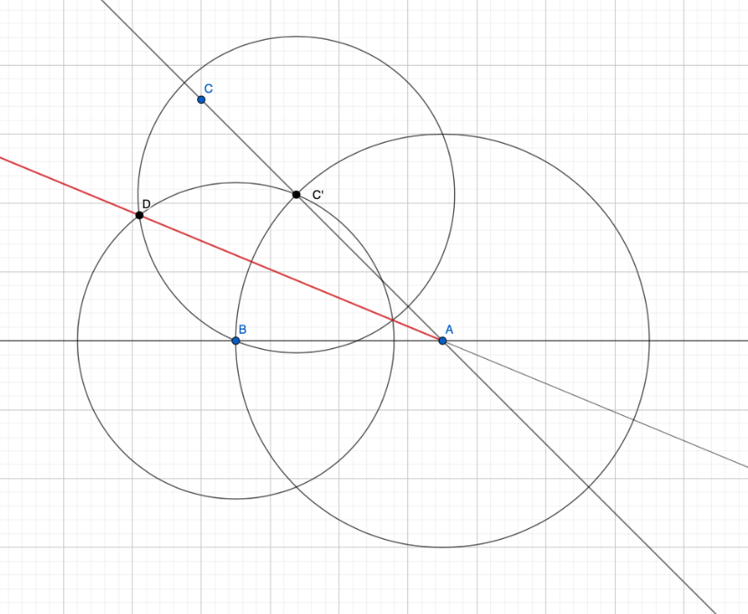

### Задача 2.

На плоскости даны три точки $A, B, C$, не лежащие на одной прямой. Постройте циркулем и линейкой биссектрису угла $BAC$.

---

1. Проведём прямую черех точки $A$ и $B$ (тип 1а),
2. Проведём прямую через точки $A$ и $C$ (тип 1а),
3. Проведём окружность с центром в точке $A$, проходящую через $B$ (тип 1б),
4. Отметим точку пересечения этой окружности с прямой $AC$, лежащую по одну сторону от $A$ с $C$, как $C'$ (тип 2),
5. Проведём окружность с центром в точке $B$, проходящую через $C'$ (тип 1б),
6. Проведём окружность с центром в точке $C'$, проходящую через $B$ (тип 1б),
7. Отметим любую точку пересечения этих двух окружностей как $D$ (тип 2),
8. Проведём прямую через точки $A$ и $D$ (тип 1а).

Прямая $AD$ - биссектриса угла $BAC$.