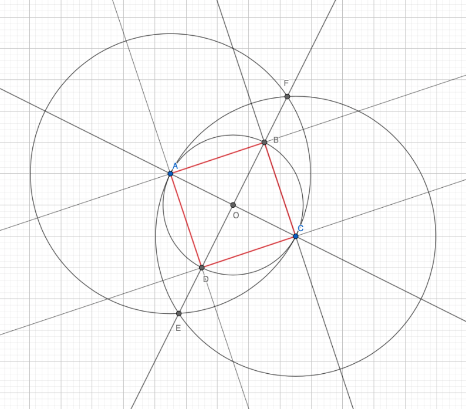

### Задача 3.

На плоскости даны точки $A$ и $C$. Постройте точки $B$ и $D$ так, чтобы четырёхугольник $ABCD$ был квадратом с диагональю $AC$.

---

1. Проведём прямую черех точки $A$ и $C$ (тип 1а),
2. Проведём окружность с центром в точке $A$, проходящую через $C$ (тип 1б),
3. Проведём окружность с центром в точке $C$, проходящую через $A$ (тип 1б),
4. Обозначим одну точку пересечения этих двух окружностей $E$, другую $F$ (тип 2),
5. Проведём прямую черех точки $E$ и $F$ (тип 1а),
6. Отметим точку пересечения прямой $EF$ с $AC$, как $O$ (тип 2),
7. Проведём окружность с центром в точке $O$, проходящую через $A$ (тип 1б),
8. Отметим точки пересечения этой окружности с $EF$, как $B$ и $D$ (тип 2).

Точки $A, B, C$ и $D$ образуют квадрат с диагональю $AC$.