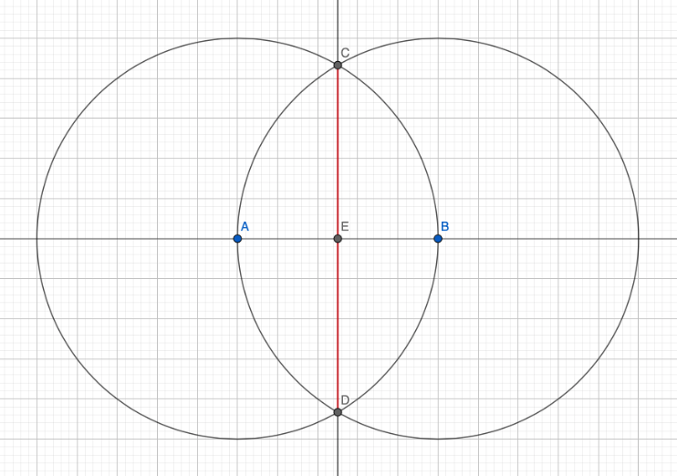

### Задача 4.

На прямой даны точки $A$ и $B$ такие, что $AB=1$. Постройте циркулем и линейкой отрезок длины $\sqrt3$.

---

1. Проведём окружность с центром в точке $A$, проходящую через $B$ (тип 1б),
2. Проведём окружность с центром в точке $B$, проходящую через $A$ (тип 1б),
3. Отметим точки пересечения этих окружностей, как $C$ и $D$ (тип 2),
4. Проведём прямую через точки $C$ и $D$ (тип 1а).

Отрезок $CD = 2ED = 2\sqrt{1^2-\big(\frac{1}{2}\big)^2}=\sqrt3$