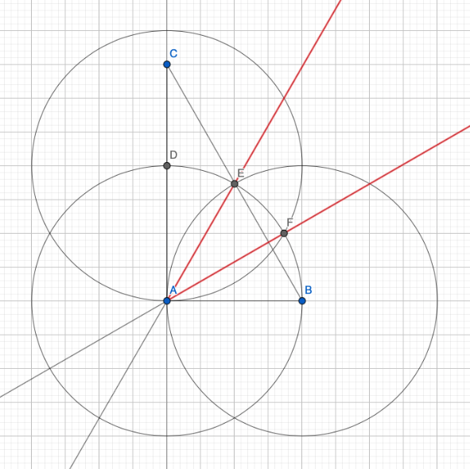

### Задача 5.

Дан прямоугольный треугольник $ABC$, в котором угол $A$ — прямой. С помощью циркуля и линейки поделите угол $A$ на три равные части.

---

1. Проведём прямую через точки $C$ и $A$ (тип 1а),
2. Проведём окружность с центром в точке $A$, проходящую через $B$ (тип 1б),
3. Отметим точку пересечения этой окружности с прямой $AC$, лежащую по одну сторону от $A$ с $C$, как $D$ (тип 2),
4. Проведём окружность с центром в точке $D$, проходящую через $A$ (тип 1б),
5. Проведём окружность с центром в точке $B$, проходящую через $A$ (тип 1б),
6. Отметим точки пересечения, лежащие в угле $BAC$ этих окружностей с первой окружностью, как $E$ и $F$ (тип 2),
7. Проведём прямую через точки $E$ и $A$ (тип 1а),
8. Проведём прямую через точки $F$ и $A$ (тип 1а).

Прямые $AF$ и $AE$ делят угол $BAC$ на три равные части.